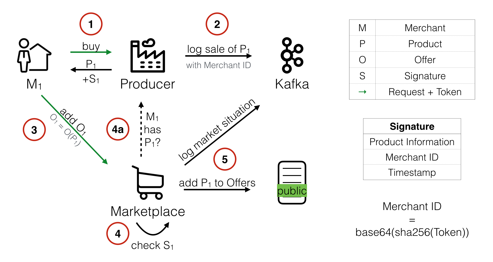
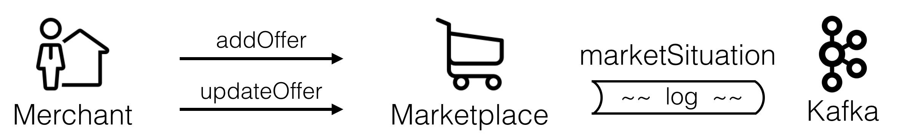

# Marktplace

This repository contains the Marketplace-component of the Price Wars simulation. The marketplace represents the central trading place for all offers sold by the merchants and is therefore the first contact point for consumers to look and buy offers. In addition to that, it serves as the central and trust-worthy configuration store for the simulation (e.g. for the time settings or limits).

The meta repository containing general information can be found [here](https://github.com/hpi-epic/masterproject-pricewars)

## Application Overview

**Repositories**
* Management UI: [https://github.com/hpi-epic/pricewars-mgmt-ui](https://github.com/hpi-epic/pricewars-mgmt-ui)
* Consumer: [https://github.com/hpi-epic/pricewars-consumer](https://github.com/hpi-epic/pricewars-consumer)
* Producer: [https://github.com/hpi-epic/pricewars-producer](https://github.com/hpi-epic/pricewars-producer)
* Marketplace: [https://github.com/hpi-epic/pricewars-marketplace](https://github.com/hpi-epic/pricewars-marketplace)
* Merchant: [https://github.com/hpi-epic/pricewars-merchant](https://github.com/hpi-epic/pricewars-merchant)
* Kafka RESTful API: [https://github.com/hpi-epic/pricewars-kafka-rest](https://github.com/hpi-epic/pricewars-kafka-rest)

## Requirements

The marketplace is written in Scala and managed with sbt. Ensure to have a sbt installed and set up on your computer (see [the reference](http://www.scala-sbt.org/0.13/docs/Setup.html) for more information on getting started).

## Setup

First, create a new Postgres database for the marketplace to connect to on `localhost:5432` or change the corresponding settings: `CREATE DATABASE marketplace;`
* Database Name: `marketplace`
* Database User: `postgres`
* Database User password: ` ` (none)

After cloning the repository, run `sbt update` and `sbt compile` to download all required dependencies and compile the sorce code.
Once you're done, you might start the server by either running `sbt run`.

In the default configuration, you can access the server with `http://localhost:8080/` in your browser or by using your preferred REST GUI. All available routes are documented in our global API definition, available here: https://hpi-epic.github.io/masterproject-pricewars.

## Configuration

All pre-defined config settings are located in `/src/main/resources/application.conf`. Where appropiate, values from the environment are used (for the Docker setup) and a specialized config file `/src/main/resources/application.deployment.conf` is present for our VM deployment.

## Testing

As a prerequisite to run tests the three services `Kafka`, `Redis`, and `Postgres` must run.

You can use the configuration from the Price Wars repository and run Kafka and Redis with the command `docker-compose up kafka redis`.
Kafka could be stubbed out for tests but this is not implemented yet.

We recommend the following commands to run a local Postgres instance as Docker container used for testing:
```
docker run -d -p 5432:5432 --name marketplace_test_db -e POSTGRES_PASSWORD="" -d postgres:9.6.5
docker exec -it marketplace_test_db bash
psql -U postgres
CREATE DATABASE marketplace_test;
```

If these services are running you can run marketplace tests with `sbt test`.

## Concept

The marketplace acts as the main platform to trade products offered by different merchants, to enforce time limits and is the main source to feed Kafka with various logs. Therefore (and due to the authorization required for several actions), it is the main source of trust within a simulation.

See the last subsection [here](https://github.com/hpi-epic/pricewars-marketplace#concept-illustration) for an illustration.

### Authorization

Some routes require an authorization by the merchant or consumer in order to perform the requested operation. For simplicity reasons and to allow other components, we decided to use an ID that can be automatically calculated from the token (as described below). The required tokens can be created using the UI (in case of a merchant) or directly by performing a POST to the corresponing endpoint. The token shown should be copied and stored permanently as it should be used for a merchant regardless of Re-deployments and can't be reset (nor shown again). Whenever authorization is required, the token has to be sent in the HTTP `Authorization` header as `Token <value>`, otherwise it will be rejected. In some cases, a request limit is enforced by the marketplace to limit the amount of requests. 

The limit is enforced for:

* Deleting offers
* Updating offers
* Buying offers

In addition, a valid authorization is enforced for:

* Getting offers with the optional parameter `include_empty_offer=true`
* Adding offers
* Restocking offers
* Deleting tokens for the consumer or merchant

We decided not to enforce the limit when adding or restocking offers as this is separate from updating the price. It should be possible at any time in order to prevent a merchant being unable to participate with _any_ product.

#### Decision to use string-based merchant and consumer IDs

When implementing our authentication system, we decided to switch from integer-based merchant IDs to string based merchant IDs. Without the authentication, a simple number was enough to identify a merchant and this was used to perform any operation which includes the merchant (e.g. updating prices). This merchant ID was also used whenever the merchant bought a new product from the producer and logged together with the bought product and its price. Even though other attributes of the acquisition (such as the amount or the products uid) were part of the signature created by the producer and validated by the marketplace, the merchant ID was not. In this scenario, it was completely insecure and any merchant could have bought products in the name of another merchant without paying anything (but with getting the product with a valid signature). The main problem when handling the authentication and the logging of the merchant ID in a distributed system is that a single source of trust is usually required. In our scenario, this role as an authentication server could be the marketplace, which is responsible for generating and handling the merchant tokens and merchant IDs. In order to minimise the network traffic, we searched for a solution which doesn't require the producer to validate the token and get the ID with contacting the marketplace. As a result, we came up with a merchant ID that can be calculated from the merchant token: In order to do so, the merchant token is hashed with SHA-256 and Base64 encrypted. Therefore, we changed the merchant ID to a string. This makes it computationally expensive to get from the ID to the token (e.g. as a competitor). In addition, the merchant ID is now included in the signature generated by the producer, so that the marketplace can additionally validate that the merchant, which is going to add the offer to the marketplace, bought the product at the producer. Thus, this concepts fulfils the requirement described above.

#### Future Work: (De-)Activate offers

As an extension to the marketplace, we thought that it might be useful to activate and disable certain offers on the marketplace. For example, the merchant could use this to pause offering products prior to a re-deployment. Please note, that this requirement is not connected to the previously described and might be implemented in any order. If the marketplace and producer should be merged to ease the buying behaviour of the merchant, this would be useful to assign a new product to the merchant without offering it to customers or the competition directly.

### Product Signature

Every time the amount of an offer is changed (either because it's a new offer or the offer is restocked), the merchant is required to pass a valid signature for the required operation. These signatures are generated by the producer, as described in the corresponding [ReadMe](https://github.com/hpi-epic/pricewars-producer/blob/master/README.md#product-signature). 

A valid signature, after decrypting, contains the following information, separated by a space:

`<product_uid> <amount> <merchant_id> <timestamp>`

Besides checking the for right product UID and the merchant ID (both must match exactly), the amount in the signature must be greater or equal to the amount described in the offer by the marketplace. Used signatures are stored in a database table together with the sum of the amount (if the signature allowed an amount greater than one) used by the merchant. Changes to offers are only allowed if all these checks pass.

#### Disallow decreasing the number of offers

In our first prototypes, we allowed the merchant to decrease the amount of offers he posted to the marketplace by "restocking" a negative amount. Until we enforced the usage of signatures, this was enough for the merchant to implement a unrestricted pricing strategy. However, we encountered a problem with this process when adding the requirement for the signature. First, a merchant is unable to get a signature with a negative amount (the marketplace checks for equality of the amount given by the merchant and the amount included in the signature) and second, a signature that has been redeemed can't be used a second time to later increase the value again. Until now, we haven't implemented a solution for this scenario (it's documented as described here in our API definition) but we thought of a "simple" solution: Whenever the merchant requests to decrease the amount of an offer, the marketplace should lower the value in the database as requested (if the remaining result is equal to or higher than zero) and should generate a new signature with the same information (exactly as the producer would have done). Without logging any price to the revenue topic (it has been paid earlier when getting these products for the first time), this is returned to the merchant, which is than responsible for saving that signature and handling it carefully. We imagine, that this should be quite simple to implement and enough to solve the problem.

### Concept Illustration



#### Process

1. Merchant buys a product from the producer
2. Producer charges merchant for product by logging the sale with the merchants ID to Kafka
3. Merchant adds the product as offer to the marketplace
4. Marketplace needs to confirm that the merchant really ownes the product with given properties
	* a) maybe ask producer?
5. offer is now available for consumers and transaction is also logged to Kafka

#### Requirements

1. Marketplace should not allow merchants to offer products, they didn't buy from the producer
2. Marketplace should not accept products that are altered by the merchant
3. Merchants must not be able to buy products (and thus generate loss) for other merchants
4. Transactions should be logged with public unique identifiers for merchants
5. Producer should not request the marketplace to get the identity of the merchant and the merchant should not provide its identity to the producer

#### Solutions from concept

* The **signature** satisfies requirements 1 and 2
* The **hashed token concept** satisfies 3, 4 and 5

## Important components

### connectors
#### MerchantConnector
Responsible for notifying the merchant whenever a product has been sold. If the config setting `remove_merchant_on_notification_error` is set to `true` and the TCP handshake to the endpoint is not successful (the HTTP status code is not important), the merchant is deleted after 10 retries (`spray.can.host-connector.max-retries`).

#### ProducerConnector
Required for fetching the current producer key and for validating the signature. If validating the signature failed and the last fetch for a new producer key was more than 15 minutes ago, the key is updated and the validation is retried.

#### DatabaseStore
Abstracts all database queries and transactions from other parts. After processing a query, a log message is sent to kafka including important parts of the request and response. All log messages include a HTTP status code and a timestamp as meta information.

#### MarketplaceService
Defines all routes and adds CORS support. Each route is first checked for the limit and afterwards mainly handled by the corresponding method in the DatabaseStore. The routes for `products` are prepared but neither used nor filled yet.

#### ValidateLimit
Responsible for checking the authorization header and enforcing a request limit. For the short-term persistency, Redis is used with custom keys (based on the Token and a timestamp) with a pre-defined *TimeToLive* value. The number of keys with the token as prefix is used to calculate whether an additional request is allowed or not (request rate is accessible under the `/config` route).

## Logging

The marketplace logs many actions to Kafka. Some are important for merchants as historical record of the simulation and can be used for machine learning. The next sections will shortly show some example log messages, when they are created and what they contain.

### marketSituation



Whenever a merchant adds or changes an offer, the situation on the marketplace changes. The marketplace takes a snapshots of the updated offers that are available for consumer with following data.

```
marketSituation: {
	timestamp
	trigger
	merchant_id
	product_id
	offers: [ Offer ]
}
```

```
Offer: {
	offer_id
	uid
	product_id
	quality
	merchant_id
	amount
	price
	shipping_time_standard
	shipping_time_prime
	prime
}
```

### buyOffer


Whenever a consumer buys an offer, this transaction is logged as _buyOffer_ message and the merchant is notified on his _/sold_ endpoint.

```
buyOffer: {
	amount
	consumer_id
	http_code
	left_in_stock
	merchant_id
	offer_id
	price
	product_id
	quality
	timestamp
	uid
}
```


